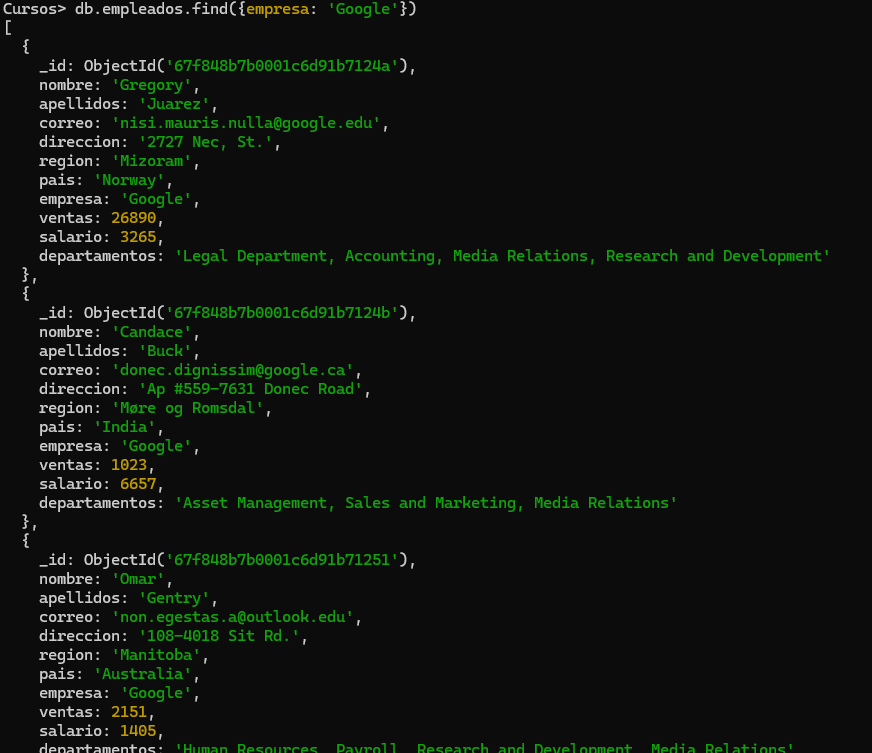
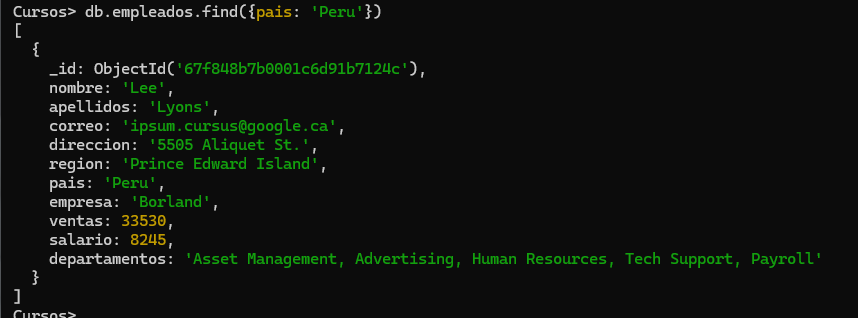
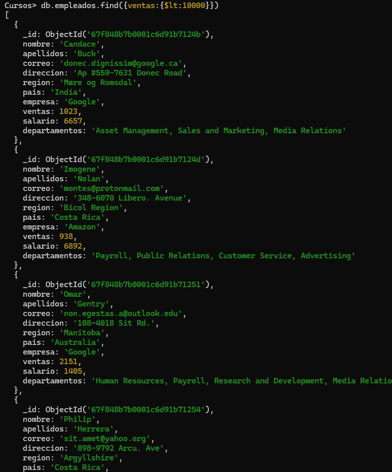
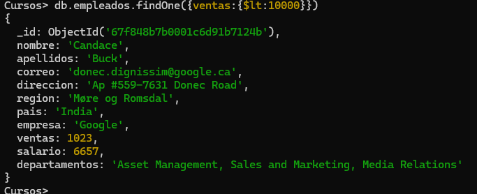
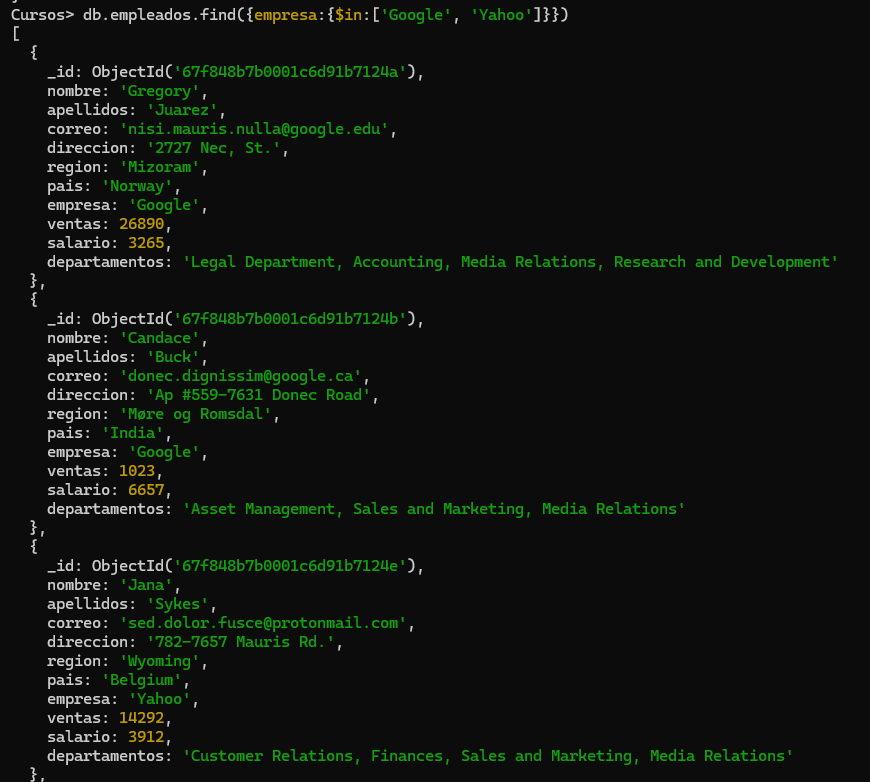
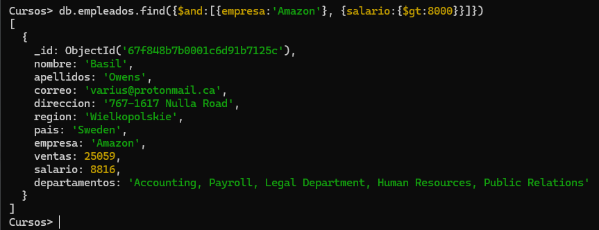
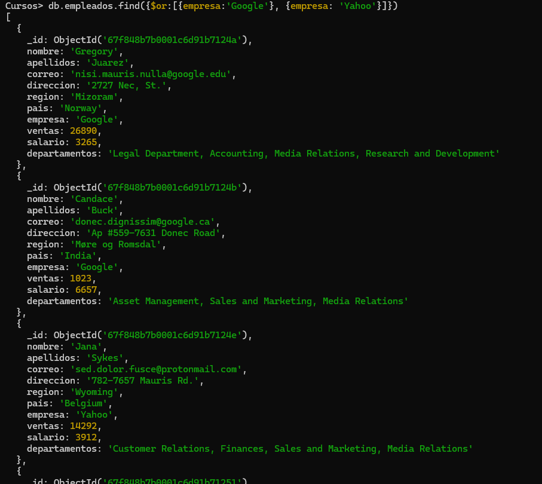
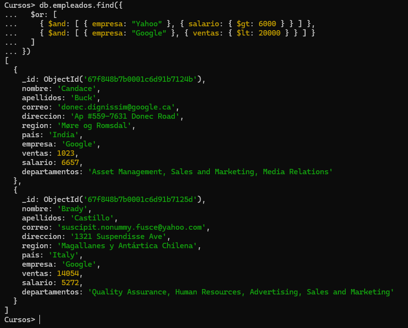
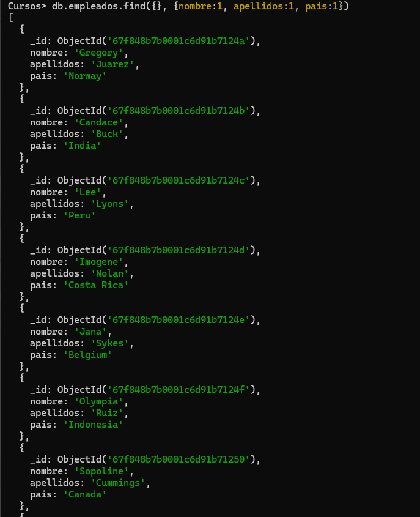

# Consultas

1. Cargar el archivo empleados.json


2. Utilizar la base de datos curso


3. Buscar todos los empleados que trabajen en google
```json
db.empleados.find({empresa: 'Google'})
```


4. Empleados que vivan en peru
```json
db.empleados.find({pais: 'Peru'})
```


5. Empleados que ganen mas de 8000 dolares
```json
db.empleados.find({salario:{$gt:8000}})
```


6. Empleados con ventas inferiores a 10000
```json
db.empleados.find({ventas:{$lt:10000}})
```


7. Realizar la consulta anterior pero devolviendo una sola fila
```json
db.empleados.findOne({ventas:{$lt:10000}})
```


8. Empleados que trabajan en google o en yahoo con el operador $in
```json
db.empleados.find({empresa:{$in:['Google', 'Yahoo']}})
```


9. Empleados de amazon que ganen mas de 8000 dolares
```json
db.empleados.find({$and:[{empresa:'Amazon'}, {salario:{$gt:8000}}]})
```


10. Empleados que trabajan en Google o en Yahoo con el operador $or
```json
db.empleados.find({$or:[{empresa:'Google'}, {empresa: 'Yahoo'}]})
```


11. Empleados que trabajen en Yahoo que ganen mas de 6000 o empleados que trabajen en Google que tengan ventas inferiores a 20000
```json
db.empleados.find({
  $or: [
    { $and: [ { empresa: "Yahoo" }, { salario: { $gt: 6000 } } ] },
    { $and: [ { empresa: "Google" }, { ventas: { $lt: 20000 } } ] }
  ]
})
```



12. Visualizar el nombre, apellidos y el país de cada empleado
```json
db.empleados.find({}, {nombre:1, apellidos:1, pais:1})
```
