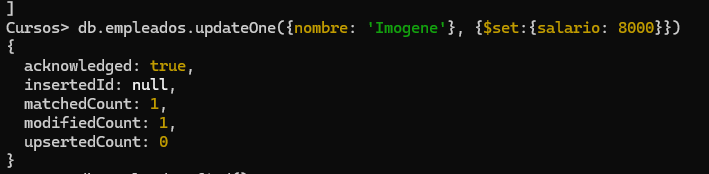
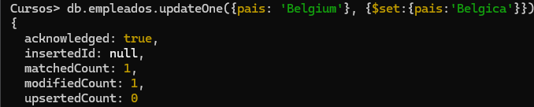
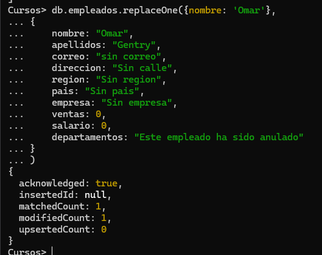
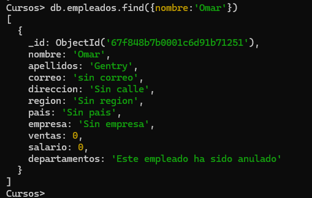
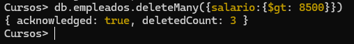
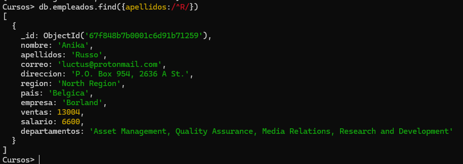
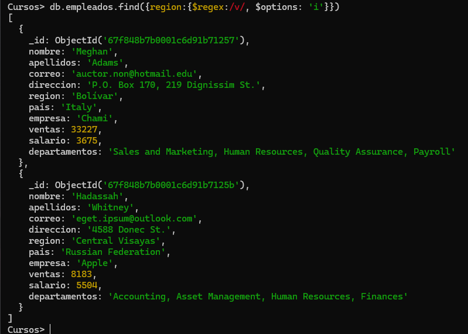
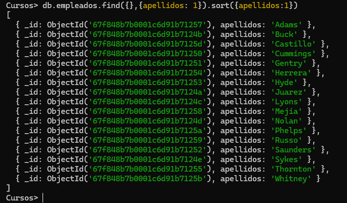
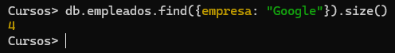

# Practica 3. Updates y Deletes

1. Cambiar el salario del empleado Imogene Nolan. Se le asigna 8000.
```json
db.empleados.updateOne({nombre: 'Imogene'}, {$set:{salario: 8000}})
```


2. Cambiar "Belgium" por "Bélgica" en los empleados (debe haber dos).
```json
db.empleados.updateOne({pais: 'Belgium'}, {$set:{pais:'Belgica'}})
```


4. Reemplazar el empleado Omar Gentry por el siguiente documento:
```json
db.empleados.replaceOne({nombre: 'Omar'}, 
{
    nombre: "Omar",
    apellidos: "Gentry",
    correo: "sin correo",
    direccion: "Sin calle",
    region: "Sin region",
    pais: "Sin pais",
    empresa: "Sin empresa",
    ventas: 0,
    salario: 0,
    departamentos: "Este empleado ha sido anulado"
}
)
```



5. Con un find comprobar que el empleado ha sido modificado
```json
db.empleados.find({nombre:'Omar'})
```


6. Borrar todos los empleados que ganen mas de 8500. Nota: deben ser borrados 3 documentos
```json
db.empleados.deleteMany({salario:{$gt: 8500}})
```


7. Visualizar con una expresión regular todos los empleados con apellidos que comiencen con "R"
```json
db.empleados.find({apellidos:/^R/})
```


8. Buscar todas las regiones que contenga un "V". Hacerlo con el operador $regex y que no distinga mayúsculas y minúsculas. Deben salir 2.
```json
db.empleados.find({region:{$regex:/v/, $options: 'i'}})
```


9. Visualizar los apellidos de los empleados ordenados por el propio apellido.
```json
db.empleados.find({},{apellidos: 1}).sort({apellidos:1})
```


10. Indicar el número de empleados que trabajan en Google.
```json
db.empleados.find({empresa: "Google"}).size()
```


11. Borrar la colección empleados y la base de datos.
```json
db.empleados.drop()
db.dropDatabase()
```